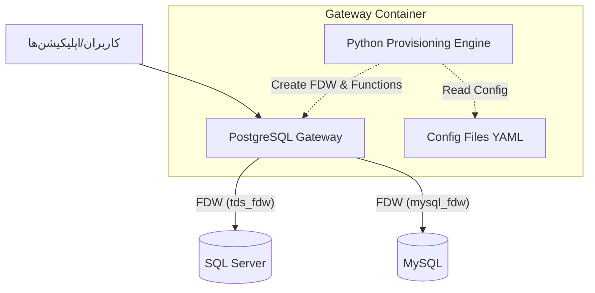
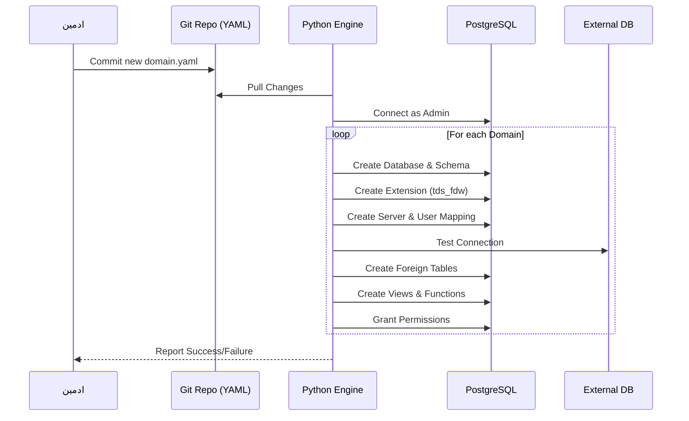
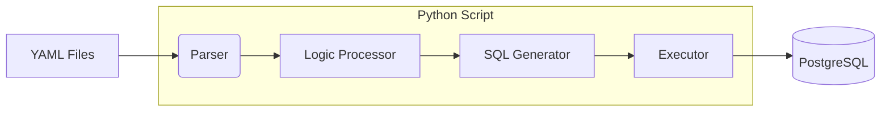

این سند جامع راهنمای معماری و پیاده‌سازی سیستم «دریچه داده پستگرس» (PostgreSQL Data Gateway) بر اساس چارچوب **TOGAF** تدوین شده است. این سند شامل تمامی مراحل از دید تجاری تا فنی، نمودارها، و کدهای کامل قابل کپی‌پیست است.

---

# سند معماری企业与 پیاده‌سازی (TOGAF ADM)

## فاز A: چشم‌انداز معماری (Architecture Vision)

### ۱. مقدمه و اهداف
هدف از این پروژه ایجاد یک **دریچه داده یکپارچه (Data Gateway)** است که امکان دسترسی امن، مدیریت‌شده و بهینه به داده‌های پراکنده در دیتابیس‌های SQL Server و MySQL را از طریق یک نمونه مرکزی PostgreSQL فراهم می‌کند.

**اهداف کلیدی:**
*   **یکپارچه‌سازی داده‌ها:** دسترسی به جداول خارجی مانند جداول محلی.
*   **امنیت مرکزی:** مدیریت دسترسی‌ها در سطح پستگرس بدون تغییر در دیتابیس‌های منبع.
*   **ماژولار بودن:** امکان افزودن دیتابیس‌های جدید تنها با ویرایش یک فایل YAML.
*   **کارایی:** استفاده از توابع افزایشی (Incremental Functions) برای خواندن داده‌های حجیم.

### ۲. نمودار سطح بالا (High-Level Architecture)



---

## فاز B: معماری کسب‌وکار (Business Architecture)

### ۱. جریان ارزش (Value Stream)
1.  **درخواست دسترسی:** ادمین درخواست دسترسی به یک دیتابیس جدید را در فایل YAML ثبت می‌کند.
2.  **تامین خودکار:** اسکریپت پایتون تغییرات را شناسایی و زیرساخت (FDW, Users) را ایجاد می‌کند.
3.  **دسترسی امن:** کاربر نهایی از طریق توابع یا جداول مجازی به داده دسترسی دارد بدون اینکه مستقیماً به منبع وصل شود.

### ۲. نمودار فرآیند Provisioning



---

## فاز C: معماری سیستم‌های اطلاعاتی (Information Systems Architecture)

### ۱. معماری داده (Data Architecture)
داده‌ها به صورت مجازی (Virtual) در پستگرس مدیریت می‌شوند. هیچ کپی فیزیکی از داده‌ها وجود ندارد مگر اینکه بصورت Materialized View تعریف شود.

**ساختار نام‌گذاری داینامیک:**
*   متغیر `__parent__`: نام پوشه والد (مثلاً `billing`).
*   متغیر `__current__`: نام پوشه جاری (مثلاً `alborz`).
*   نتیجه: `billing_alborz_db`.

### ۲. معماری کاربردی (Application Architecture)
**موتور Provisioning (Python):**
این اسکریپت مغز متفکر سیستم است. وظایف آن:
1.  خواندن فایل‌های YAML.
2.  تشخیص تغییرات.
3.  تولید و اجرای دستورات DDL (Data Definition Language).

**نمودار کامپوننت:**



---

## فاز D: معماری فناوری (Technology Architecture)

### ۱. پشته فناوری (Technology Stack)
*   **زیرساخت:** Docker / Docker Compose.
*   **دیتابیس:** PostgreSQL 18 (برای پشتیبانی بهتر از PL/pgSQL و FDW).
*   **درایورها:** `tds_fdw` (برای SQL Server)، `mysql_fdw`.
*   **کتابخانه کمکی:** FreeTDS (نسخه 1.4.7).

### ۲. استراتژی FDW (راهنمای کامل Foreign Data Wrapper)

**الف) مفهوم FDW:**
FDW یا بسته‌بندی داده‌های خارجی، استانداردی در SQL است که به پستگرس اجازه می‌دهد داده‌های دیتابیس‌های دیگر را مانند جداول خودش کوئری بزند.

**ب) جریان داده در FDW:**

```mermaid
graph LR
    Q[SQL Query] --> PG[PostgreSQL Planner]
    PG --> FDW[FDW Handler]
    FDW -- "Generate Remote SQL" --> LIB[Library (FreeTDS/ODBC)]
    LIB -- "TDS Protocol" --> MSSQL[(SQL Server)]
    MSSQL -- "Data Rows" --> FDW
    FDW -- "Return Rows" --> PG
```

**ج) پیکربندی حیاتی (FreeTDS):**
برای اتصال به SQL Server، فایل `freetds.conf` نقش واسط را دارد. تنظیم نادرست آن منجر به خطای `TDS_DEAD` یا قطع اتصال می‌شود.

---

## فاز E & G: پیاده‌سازی و راهنمای عملیاتی (Implementation & Governance)

در این بخش تمامی کدهای لازم برای بالا آوردن سیستم به صورت کامل ارائه شده است.

### ۱. ساختار پوشه‌ها (Directory Structure)
```text
project_root/
├── docker/
│   └── Dockerfile
├── scripts/
│   ├── provision.py
│   ├── init-db.sh
│   └── backup.sh
├── configs/
│   ├── freetds.conf
│   └── domains/
│       ├── billing/
│       │   └── 26/
│       │       └── db_hot26.yaml
│       └── brc/
│           └── domain.yaml
├── docker-compose.yml
└── .env
```

### ۲. فایل‌های کانفیگ

#### فایل `configs/freetds.conf`
این فایل برای اتصال پایدار tds_fdw ضروری است.

```ini
[global]
    # نسخه پروتکل برای SQL Server 2012 به بالا
    tds version = 7.4
    client charset = UTF-8
    
    # تنظیمات تایم‌اوت برای جلوگیری از قطع شدن
    connect timeout = 60
    query timeout = 600
    
    # Keep-Alive برای اتصالات طولانی
    keep alive = 1
    keep alive idle = 60
    keep alive interval = 10
    keep alive count = 5
    
    text size = 64512

# تعریف بخش اختصاصی (مثال)
[BILLING_26]
    host = ${BILLING_DB_HOST_26}
    port = ${BILLING_DB_PORT}
    tds version = 7.4
```

#### فایل نمونه `configs/domains/billing/26/db_hot26.yaml`
این فایل تعریف‌کننده دیتابیس و توابع است.

```yaml
database:
  name: ${__parent__}_${__current__}_db 

fdws:
  - name: hot26_alborz_link_local
    type: tds
    config_section: BILLING_26
    user: ${BILLING_DB_USER}
    password: ${BILLING_DB_PASSWORD}

schemas:
  - name: hot_26  

tables:
  - name: hot_26.billparts
    type: foreign
    server: hot26_alborz_link_local
    remote_schema: dbo
    remote_table: billparts
    columns:           
      - {name: _billid, type: bigint}
      - {name: persianyear, type: smallint}
      - {name: persianmonth, type: smallint}
      # سایر ستون‌ها...

# تعریف تابع سفارشی
custom_functions:
  - name: hot_26.get_billparts_stats
    target_table: hot_26.billparts
    return_columns:
      - name: total_count
        type: bigint
        expression: count(*)
      - name: min_id
        type: bigint
        expression: min(_billid)
    filter_columns:         
      - name: persianyear
        type: int
      - name: persianmonth
        type: int
    allowed_consumers:
      - ${PENDAR_ETL_USER}
```

### ۳. داکر فایل (`docker/Dockerfile`)

```dockerfile
############################################
# Stage 1 – Builder (FDWs + FreeTDS)
############################################
FROM postgres:18.1-bookworm AS builder

ENV DEBIAN_FRONTEND=noninteractive \
    TZ=Asia/Tehran \
    FREETDS_VERSION=1.4.7

WORKDIR /build

# Debian sources
RUN rm -f /etc/apt/sources.list /etc/apt/sources.list.d/* && \
    printf "deb http://mirror.arvancloud.ir/debian bookworm main contrib non-free\n\
deb http://mirror.arvancloud.ir/debian-security bookworm-security main contrib non-free\n\
deb http://mirror.arvancloud.ir/debian bookworm-updates main contrib non-free\n" \
    > /etc/apt/sources.list

# Build tools
RUN apt-get update && apt-get install -y --no-install-recommends \
    build-essential git wget gnupg2 dirmngr lsb-release \
    autoconf automake libtool pkg-config libssl-dev \
    libiconv-hook-dev unixodbc-dev default-libmysqlclient-dev ca-certificates \
    && rm -rf /var/lib/apt/lists/*

# PostgreSQL dev package
RUN wget -qO- https://www.postgresql.org/media/keys/ACCC4CF8.asc | gpg --dearmor > /usr/share/keyrings/pgdg.gpg
RUN echo "deb [signed-by=/usr/share/keyrings/pgdg.gpg] http://apt.postgresql.org/pub/repos/apt bookworm-pgdg main" > /etc/apt/sources.list.d/pgdg.list
RUN apt-get update && apt-get install -y --no-install-recommends postgresql-server-dev-18 && rm -rf /var/lib/apt/lists/*

# Build FreeTDS
RUN wget https://www.freetds.org/files/stable/freetds-${FREETDS_VERSION}.tar.gz && \
    tar -xzf freetds-${FREETDS_VERSION}.tar.gz && \
    cd freetds-${FREETDS_VERSION} && \
    ./configure --prefix=/usr/local --with-openssl --enable-msdblib --enable-sybase-compat --disable-odbc && \
    make -j$(nproc) && make install && ldconfig

# Build mysql_fdw
RUN git clone --depth 1 https://github.com/EnterpriseDB/mysql_fdw.git && \
    cd mysql_fdw && make USE_PGXS=1 && make USE_PGXS=1 install

# Build tds_fdw
RUN git clone --depth 1 https://github.com/tds-fdw/tds_fdw.git && \
    cd tds_fdw && make USE_PGXS=1 FREETDS_CONFIG=/usr/local/bin/freetds-config && make USE_PGXS=1 install

############################################
# Stage 2 – Runtime PostgreSQL
############################################
FROM postgres:18.1-bookworm

ENV DEBIAN_FRONTEND=noninteractive TZ=Asia/Tehran

WORKDIR /app

# Runtime dependencies
RUN rm -f /etc/apt/sources.list /etc/apt/sources.list.d/* && \
    printf "deb http://mirror.arvancloud.ir/debian bookworm main contrib non-free\n\
deb http://mirror.arvancloud.ir/debian-security bookworm-security main contrib non-free\n\
deb http://mirror.arvancloud.ir/debian bookworm-updates main contrib non-free\n" > /etc/apt/sources.list

RUN apt-get update && apt-get install -y --no-install-recommends \
    ca-certificates tzdata openssl cron python3 python3-pip wget gnupg2 \
    unixodbc libssl3 libiconv-hook1 default-libmysqlclient-dev \
    && rm -rf /var/lib/apt/lists/*

# Install Microsoft ODBC Driver 18
RUN wget -qO- https://packages.microsoft.com/keys/microsoft.asc | gpg --dearmor > /usr/share/keyrings/microsoft-prod.gpg
RUN echo "deb [signed-by=/usr/share/keyrings/microsoft-prod.gpg] https://packages.microsoft.com/debian/12/prod bookworm main" > /etc/apt/sources.list.d/microsoft-prod.list
RUN apt-get update && ACCEPT_EULA=Y apt-get install -y --no-install-recommends msodbcsql18 && rm -rf /var/lib/apt/lists/*

# Copy FDWs + FreeTDS from builder
COPY --from=builder /usr/local /usr/local
COPY --from=builder /usr/lib/postgresql/18/lib/*mysql* /usr/lib/postgresql/18/lib/
COPY --from=builder /usr/lib/postgresql/18/lib/*tds* /usr/lib/postgresql/18/lib/
COPY --from=builder /usr/share/postgresql/18/extension/*mysql* /usr/share/postgresql/18/extension/
COPY --from=builder /usr/share/postgresql/18/extension/*tds* /usr/share/postgresql/18/extension/
RUN ldconfig

# FreeTDS config
RUN mkdir -p /etc/freetds
COPY ./configs/freetds.conf /etc/freetds/freetds.conf
ENV FREETDSCONF=/etc/freetds/freetds.conf

# Python packages
RUN pip3 install --break-system-packages psycopg2-binary pyyaml -i https://pypi.tuna.tsinghua.edu.cn/simple

# App scripts
COPY scripts ./scripts
COPY configs ./configs
RUN chmod +x ./scripts/*.sh && touch /var/log/backup.log

# Cron
RUN echo "0 2 * * * /app/scripts/backup.sh >> /var/log/backup.log 2>&1" > /etc/cron.d/pg-backup
RUN chmod 0644 /etc/cron.d/pg-backup && crontab /etc/cron.d/pg-backup

# Healthcheck
HEALTHCHECK --interval=30s --timeout=5s --start-period=30s CMD pg_isready -U $POSTGRES_USER -d $POSTGRES_DB || exit 1

CMD []
```

### ۴. اسکریپت‌های شروع و پشتیبان‌گیری

#### `scripts/init-db.sh`
```bash
#!/bin/bash
set -e

echo "🚀 Starting PostgreSQL Gateway Initialization..."

PYTHON_SCRIPT_PATH="/app/scripts/provision.py"

# 1. Start Cron
echo "🕒 Starting Cron Service..."
service cron start

# 2. Ensure socket directory
mkdir -p /var/run/postgresql
chown postgres:postgres /var/run/postgresql
chmod 775 /var/run/postgresql

# 3. Start PostgreSQL in background
echo "⏳ Starting PostgreSQL in background..."
docker-entrypoint.sh postgres &
POSTGRES_PID=$!

# 4. Wait for PostgreSQL
sleep 2
echo "⏳ Waiting for PostgreSQL to accept connections..."
until pg_isready -U "$POSTGRES_USER" -d "$POSTGRES_DB"; do
  echo "Waiting for database..."
  sleep 1
done
echo "✅ PostgreSQL is ready."

# 5. Run Python Provisioning
if [ -f "$PYTHON_SCRIPT_PATH" ]; then
    echo "🐍 Running Python initialization script..."
    gosu postgres python3 "$PYTHON_SCRIPT_PATH"
    echo "✅ Python script executed successfully."
else
    echo "⚠️  Python script not found. Skipping."
fi

# 6. Stop temporary PostgreSQL
echo "🛑 Stopping temporary PostgreSQL process..."
gosu postgres pg_ctl -D "$PGDATA" -m fast stop
wait $POSTGRES_PID 2>/dev/null || true

# 7. Start Final PostgreSQL
echo "🚀 Starting PostgreSQL in foreground mode..."
exec docker-entrypoint.sh postgres
```

#### `scripts/backup.sh`
```bash
#!/bin/bash
TIMESTAMP=$(date +%Y%m%d_%H%M%S)
BACKUP_FILE="${BACKUP_DIR}/full_backup_${TIMESTAMP}.dump"

echo "📦 Starting backup to ${BACKUP_FILE}..."
mkdir -p "${BACKUP_DIR}"

PGPASSWORD="${POSTGRES_PASSWORD}" pg_dump \
  -h localhost -U "${POSTGRES_USER}" -d "${POSTGRES_DB}" \
  -F c -f "${BACKUP_FILE}"

if [ $? -eq 0 ]; then
  echo "✅ Backup successful: ${BACKUP_FILE}"
  echo "🧹 Cleaning old backups..."
  find "${BACKUP_DIR}" -type f -name "*.dump" -mtime +${BACKUP_RETENTION_DAYS} -delete
else
  echo "❌ Backup failed!"
fi
```

### ۵. موتور Provisioning پایتون (کامل و بدون حذف)

این کد شامل تمامی اصلاحات اعمال شده (Static SQL، رفع خطاهای FDW، مدیریت توابع) است.

**فایل: `scripts/provision.py`**

```python
import os
import psycopg2
from psycopg2 import sql
import yaml
from pathlib import Path
from collections import defaultdict

# ==========================================
# تنظیمات سراسری
# ==========================================
DB_ADMIN_USER = os.environ.get('POSTGRES_USER')
DB_ADMIN_PASS = os.environ.get('POSTGRES_PASSWORD')
DB_DEFAULT_NAME = os.environ.get('POSTGRES_DB')

def connect(db='postgres'):
    try:
        conn = psycopg2.connect(
            host='localhost', port='5432',
            user=DB_ADMIN_USER,
            password=DB_ADMIN_PASS,
            database=db
        )
        conn.autocommit = True
        return conn
    except Exception as e:
        print(f"❌ Connection failed to {db}: {e}")
        raise

def resolve_global_env(val):
    if not isinstance(val, str): return val
    if val.startswith('${') and val.endswith('}'):
        env_key = val[2:-1]
        resolved = os.environ.get(env_key)
        if not resolved: return val
        return resolved
    return val

def resolve_config_val(val, context_vars):
    if not isinstance(val, str): return val
    for key, value in context_vars.items():
        val = val.replace(f"${{{key}}}", value)
    if val.startswith('${') and val.endswith('}'):
        env_key = val[2:-1]
        resolved = os.environ.get(env_key, val)
        return resolved
    return val

def parse_identifier(name_str):
    if not name_str: return None
    parts = name_str.split('.')
    return sql.Identifier(*parts)

# ==========================================
# زیرساخت امنیتی
# ==========================================

def setup_security_infrastructure(conn_db):
    cur = conn_db.cursor()
    cur.execute("""
        CREATE TABLE IF NOT EXISTS auth_policies (
            username VARCHAR(255) PRIMARY KEY, 
            allowed_start TIME, 
            allowed_end TIME, 
            description TEXT
        );
    """)
    cur.execute("""
        CREATE OR REPLACE FUNCTION enforce_access_policy() RETURNS VOID AS $$
        DECLARE rec RECORD; 
        BEGIN
            SELECT * INTO rec FROM auth_policies WHERE username = current_user;
            IF FOUND AND rec.allowed_start IS NOT NULL AND rec.allowed_end IS NOT NULL THEN
                IF current_time < rec.allowed_start OR current_time > rec.allowed_end THEN
                    RAISE EXCEPTION 'Access DENIED for % outside allowed hours', current_user;
                END IF;
            END IF;
        END; $$ LANGUAGE plpgsql;
    """)
    cur.close()

# ==========================================
# توابع افزایشی (Incremental Jobs)
# ==========================================

def create_incremental_job_functions(conn_db, jobs_config, context_vars):
    cur = conn_db.cursor()
    for job in jobs_config:
        func_name_str = resolve_config_val(job['name'], context_vars)
        target_table_str = resolve_config_val(job['target_table'], context_vars)
        key_column = job['key_column']
        key_type_raw = job['key_type']
        key_type = key_type_raw.lower()
        
        batch_size = job.get('batch_size', 1000)
        max_limit = job.get('max_limit', batch_size * 10) 
        filter_columns = job.get('filter_columns', [])
        
        default_val = "0"
        declare_section = ""
        logic_section = ""
        
        func_args_list = [
            f"p_last_{key_column} {key_type_raw} DEFAULT {default_val}",
            "p_limit INTEGER DEFAULT {}".format(batch_size)
        ]
        
        for fc in filter_columns:
            fc_name = fc['name']
            fc_type = fc['type']
            func_args_list.append(f"p_{fc_name} {fc_type} DEFAULT NULL")
        
        func_args_sql = ", ".join(func_args_list)
        
        if 'int' in key_type or 'num' in key_type or 'serial' in key_type:
            default_val = "0"
            declare_section = f"""
                v_limit INTEGER;
                v_start_val BIGINT;
                v_end_val BIGINT;
                v_query TEXT;
                r RECORD;
            """
            logic_section = f"""
                v_limit := LEAST(COALESCE(p_limit, {batch_size}), {max_limit});
                v_start_val := p_last_{key_column};
                v_end_val := p_last_{key_column} + v_limit;
                
                v_query := 'SELECT * FROM {target_table_str} ' ||
                           'WHERE {key_column} > ' || v_start_val::text || 
                           ' AND {key_column} <= ' || v_end_val::text;
            """
            
        elif 'time' in key_type or 'date' in key_type:
            default_val = "'1900-01-01 00:00:00'::timestamp"
            declare_section = f"""
                v_limit INTEGER;
                v_start_val TIMESTAMP;
                v_end_val TIMESTAMP;
                v_query TEXT;
                r RECORD;
            """
            logic_section = f"""
                v_limit := LEAST(COALESCE(p_limit, {batch_size}), {max_limit});
                v_start_val := p_last_{key_column};
                v_end_val := p_last_{key_column} + make_interval(days => v_limit);
                
                v_query := 'SELECT * FROM {target_table_str} ' ||
                           'WHERE {key_column} > ' || quote_literal(v_start_val) || 
                           ' AND {key_column} <= ' || quote_literal(v_end_val);
            """
        else:
            print(f"      ⚠️ Key type '{key_type}' not supported.")
            continue

        filter_logic_block = []
        for fc in filter_columns:
            fc_name = fc['name']
            fc_type = fc['type']
            fc_type_lower = fc_type.lower()
            
            if 'int' in fc_type_lower or 'num' in fc_type_lower or 'serial' in fc_type_lower:
                filter_logic_block.append(f"""
                IF p_{fc_name} IS NOT NULL THEN
                   v_query := v_query || ' AND {fc_name} = ' || p_{fc_name}::{fc_type}::text;
                END IF;
                """)
            else:
                filter_logic_block.append(f"""
                IF p_{fc_name} IS NOT NULL THEN
                   v_query := v_query || ' AND {fc_name} = ' || quote_literal(p_{fc_name});
                END IF;
                """)

        filter_logic_sql = "\n".join(filter_logic_block)

        execution_block = f"""
            {filter_logic_sql}
            FOR r IN EXECUTE v_query LOOP
                RETURN NEXT r;
            END LOOP;
        """

        func_sql = f"""
        CREATE OR REPLACE FUNCTION {func_name_str}(
            {func_args_sql}
        )
        RETURNS SETOF {target_table_str} 
        LANGUAGE plpgsql 
        SECURITY DEFINER 
        AS $$
        DECLARE
            {declare_section}
        BEGIN
            {logic_section}
            {execution_block}
            RETURN;
        END;
        $$;
        """
        
        try:
            cur.execute(func_sql)
            print(f"      ⚙️  Created Incremental Function: {func_name_str}")
        except Exception as e:
            print(f"      ❌ Function Error: {e}")
    cur.close()

# ==========================================
# توابع سفارشی (Custom Functions)
# ==========================================

def create_custom_functions(conn_db, functions_config, context_vars):
    cur = conn_db.cursor()
    for func in functions_config:
        func_name_str = resolve_config_val(func['name'], context_vars)
        
        # حالت ۱: تعریف با آرگومان و SQL خام
        if 'arguments' in func or ('returns' in func and 'sql' in func and 'target_table' not in func):
            args_list = []
            for arg in func.get('arguments', []):
                args_list.append(f"{arg['name']} {arg['type']}")
            args_sql = ", ".join(args_list)
            
            ret_type = func.get('returns', 'void')
            lang = func.get('language', 'plpgsql')
            body = func['sql']
            body_resolved = resolve_config_val(body, context_vars)
            
            func_sql = f"""
            CREATE OR REPLACE FUNCTION {func_name_str}({args_sql})
            RETURNS {ret_type}
            LANGUAGE {lang}
            AS $$
            {body_resolved}
            $$;
            """
            
            try:
                cur.execute(func_sql)
                print(f"      ⚙️  Created Structured Function: {func_name_str}")
            except Exception as e:
                print(f"      ❌ Structured Function Error {func_name_str}: {e}")
            continue

        # حالت ۲: Raw SQL
        if 'sql' in func:
            raw_sql = func['sql']
            raw_sql_resolved = resolve_config_val(raw_sql, context_vars)
            try:
                cur.execute(sql.SQL(raw_sql_resolved))
                print(f"      ⚙️  Created Raw SQL Function: {func_name_str}")
            except Exception as e:
                print(f"      ❌ Raw SQL Function Error {func_name_str}: {e}")
            continue

        # حالت ۳: تولید خودکار (Static SQL - Optimized for FDW)
        target_table_str = resolve_config_val(func['target_table'], context_vars)
        
        return_columns = func.get('return_columns', [])
        filter_columns = func.get('filter_columns', [])
        
        if not return_columns:
            print(f"      ⚠️ Skipping {func_name_str}: definition unclear.")
            continue
            
        ret_def_list = [f"{rc['name']} {rc['type']}" for rc in return_columns]
        ret_def_sql = ", ".join(ret_def_list)
        
        select_expr_list = [f"{rc['expression']} AS {rc['name']}" for rc in return_columns]
        select_expr_sql = ", ".join(select_expr_list)
        
        args_list = [f"p_{fc['name']} {fc['type']} DEFAULT NULL" for fc in filter_columns]
        args_sql = ", ".join(args_list)
        
        # تولید شرط‌های WHERE (Static SQL)
        where_parts = []
        for fc in filter_columns:
            fc_name = fc['name']
            fc_op = fc.get('filter_type', '=')
            
            # شرط امن: اگر ورودی NULL باشد، شرط نادیده گرفته می‌شود
            cond = f"({fc_name} {fc_op} p_{fc_name} OR p_{fc_name} IS NULL)"
            where_parts.append(cond)
            
        where_clause = " AND ".join(where_parts)
        if not where_clause:
            where_clause = "TRUE"

        drop_types_list = [fc['type'] for fc in filter_columns]
        drop_types_sql = ", ".join(drop_types_list)
        drop_sql = f"DROP FUNCTION IF EXISTS {func_name_str}({drop_types_sql});"
        
        func_sql = f"""
        {drop_sql}
        
        CREATE OR REPLACE FUNCTION {func_name_str}({args_sql})
        RETURNS TABLE({ret_def_sql})
        LANGUAGE plpgsql
        SECURITY DEFINER
        AS $$
        BEGIN
            RETURN QUERY
            SELECT {select_expr_sql} 
            FROM {target_table_str} 
            WHERE {where_clause};
        END;
        $$;
        """
        
        try:
            cur.execute(func_sql)
            print(f"      ⚙️  Created Generated Function (Static): {func_name_str}")
        except Exception as e:
            print(f"      ❌ Function Error {func_name_str}: {e}")
    cur.close()

# ==========================================
# منطق اصلی پردازش
# ==========================================

def create_global_users(all_users_list):
    if not all_users_list: return
    print("👥 Creating Global Users (Roles)...")
    conn_glob = connect(DB_DEFAULT_NAME)
    cur = conn_glob.cursor()
    created_set = set()
    for user_data in all_users_list:
        username = resolve_global_env(user_data.get('username'))
        password = resolve_global_env(user_data.get('password'))
        if not username or not password: continue
        if username in created_set: continue
        try:
            cur.execute(sql.SQL("CREATE USER {} WITH PASSWORD %s;").format(sql.Identifier(username)), (password,))
            print(f"   ✅ Created user: {username}")
            created_set.add(username)
        except psycopg2.errors.DuplicateObject:
            try:
                cur.execute(sql.SQL("ALTER USER {} WITH PASSWORD %s;").format(sql.Identifier(username)), (password,))
            except: pass
            created_set.add(username)
        except Exception as e:
            print(f"   ❌ User creation error ({username}): {e}")
    conn_glob.close()

def scan_and_collect_users(config_dir):
    users_list = []
    for folder_name in ['users', 'user']:
        for u_file in config_dir.rglob(f"{folder_name}/*.yaml"):
            try:
                with open(u_file, 'r') as f:
                    user_cfg = yaml.safe_load(f)
                    if user_cfg and (user_cfg.get('username') or user_cfg.get('name')):
                        users_list.append({
                            'username': resolve_global_env(user_cfg.get('username', user_cfg.get('name'))),
                            'password': resolve_global_env(user_cfg.get('password'))
                        })
            except: pass
    return users_list

def process_single_database(db_name_resolved, db_data, context_vars):
    print(f"\n   {'='*15} DATABASE: {db_name_resolved} {'='*15}")
    
    conn_admin = connect(DB_DEFAULT_NAME)
    db_owner = DB_ADMIN_USER
    for cfg in db_data['configs']:
        if 'database' in cfg and 'owner' in cfg['database']:
            db_owner = resolve_config_val(cfg['database']['owner'], context_vars)
            break

    try:
        conn_admin.cursor().execute(sql.SQL("CREATE DATABASE {} OWNER {};").format(sql.Identifier(db_name_resolved), sql.Identifier(db_owner)))
        print("      ✅ Database created.")
    except psycopg2.errors.DuplicateDatabase:
        print("      ℹ️  Database exists.")
    except Exception as e:
        print(f"      ❌ DB Error: {e}")
        conn_admin.close()
        return
    finally:
        conn_admin.close()

    conn_db = connect(db_name_resolved)
    cur = conn_db.cursor()

    for ext in ['mysql_fdw', 'tds_fdw', 'pg_stat_statements']:
        try: cur.execute(sql.SQL("CREATE EXTENSION IF NOT EXISTS {};").format(sql.Identifier(ext)))
        except: pass
    
    setup_security_infrastructure(conn_db)

    all_schemas = []
    all_fdws = []
    all_tables = []
    all_views = []
    all_jobs = []
    all_custom_funcs = []
    all_permissions = []
    
    schema_names_set = set()
    fdw_names_set = set()
    table_names_set = set()
    view_names_set = set()
    job_names_set = set()
    custom_func_names_set = set()

    for cfg in db_data['configs']:
        for s in cfg.get('schemas', []):
            s_name = resolve_config_val(s['name'], context_vars)
            if s_name not in schema_names_set:
                all_schemas.append(s); schema_names_set.add(s_name)
        
        for f in cfg.get('fdws', []):
            f_name = resolve_config_val(f['name'], context_vars)
            if f_name not in fdw_names_set:
                all_fdws.append(f); fdw_names_set.add(f_name)
                
        for t in cfg.get('tables', []):
            t_name = resolve_config_val(t['name'], context_vars)
            if t_name not in table_names_set:
                all_tables.append(t); table_names_set.add(t_name)
                
        for v in cfg.get('views', []):
            v_name = resolve_config_val(v['name'], context_vars)
            if v_name not in view_names_set:
                all_views.append(v); view_names_set.add(v_name)
                
        for j in cfg.get('incremental_jobs', []):
            j_name = resolve_config_val(j['name'], context_vars)
            if j_name not in job_names_set:
                all_jobs.append(j); job_names_set.add(j_name)
        
        for cf in cfg.get('custom_functions', []):
            cf_name = resolve_config_val(cf['name'], context_vars)
            if cf_name not in custom_func_names_set:
                all_custom_funcs.append(cf); custom_func_names_set.add(cf_name)

    for perm_cfg in db_data['user_permissions']:
        all_permissions.append(perm_cfg)

    print("      🏗️  Schemas...")
    for s in all_schemas:
        s_name = resolve_config_val(s['name'], context_vars)
        cur.execute(sql.SQL("CREATE SCHEMA IF NOT EXISTS {};").format(sql.Identifier(s_name)))

    print("      🌐 FDWs...")
    fdw_credentials = {}
    
    for fdw in all_fdws:
        fdw_name = resolve_config_val(fdw['name'], context_vars)
        fdw_type = fdw['type']
        options = {}
        
        if fdw_type == 'tds':
            if 'config_section' in fdw:
                options['servername'] = fdw['config_section']
                if 'database' in fdw: options['database'] = resolve_config_val(fdw['database'], context_vars)
            else:
                host_val = resolve_config_val(fdw.get('host'), context_vars)
                options['servername'] = host_val
                options['port'] = str(resolve_config_val(fdw.get('port'), context_vars))
                if 'database' in fdw: options['database'] = resolve_config_val(fdw['database'], context_vars)
            options['tds_version'] = fdw.get('tds_version', '7.4')

        elif fdw_type == 'mysql':
            options['host'] = resolve_config_val(fdw.get('host'), context_vars)
            options['port'] = str(resolve_config_val(fdw.get('port'), context_vars))
            if 'database' in fdw: options['dbname'] = resolve_config_val(fdw['database'], context_vars)

        opts_sql = sql.SQL(', ').join([sql.SQL("{} {}").format(sql.Identifier(k), sql.Literal(v)) for k,v in options.items() if v])
        
        try: 
            cur.execute(sql.SQL("CREATE SERVER {} FOREIGN DATA WRAPPER {} OPTIONS ({});").format(
                sql.Identifier(fdw_name), sql.Identifier(f"{fdw_type}_fdw"), opts_sql))
        except psycopg2.errors.DuplicateObject: 
            pass
        
        fdw_credentials[fdw_name] = {
            'user': resolve_config_val(fdw['user'], context_vars),
            'password': resolve_config_val(fdw['password'], context_vars)
        }

    print("      📊 Tables...")
    for tbl in all_tables:
        tbl_name = resolve_config_val(tbl['name'], context_vars)
        server_name = resolve_config_val(tbl['server'], context_vars)
        cols = sql.SQL(', ').join([sql.SQL("{} {}").format(sql.Identifier(c['name']), sql.SQL(c['type'])) for c in tbl['columns']])
        
        opts = []
        if 'remote_schema' in tbl: opts.append(sql.SQL("schema_name {}").format(sql.Literal(tbl['remote_schema'])))
        if 'remote_table' in tbl: opts.append(sql.SQL("table_name {}").format(sql.Literal(tbl['remote_table'])))
        opts_sql = sql.SQL(', ').join(opts)
        
        try: 
            cur.execute(sql.SQL("CREATE FOREIGN TABLE {} ({}) SERVER {} OPTIONS ({});").format(parse_identifier(tbl_name), cols, sql.Identifier(server_name), opts_sql))
            print(f"         ✅ Created table: {tbl_name}")
        except psycopg2.errors.DuplicateTable: 
            print(f"         ℹ️  Table exists: {tbl_name}")
        except Exception as e: 
            print(f"      ❌ Table Error {tbl_name}: {e}")

    print("      👁️  Views...")
    for vw in all_views:
        vw_name = resolve_config_val(vw['name'], context_vars)
        vw_sql = resolve_config_val(vw['sql'], context_vars)
        try: 
            cur.execute(sql.SQL("CREATE OR REPLACE VIEW {} AS {};").format(parse_identifier(vw_name), sql.SQL(vw_sql)))
        except Exception as e: 
            print(f"      ❌ View Error {vw_name}: {e}")

    if all_jobs:
        create_incremental_job_functions(conn_db, all_jobs, context_vars)
    
    if all_custom_funcs:
        create_custom_functions(conn_db, all_custom_funcs, context_vars)

    print("      🔐 Permissions...")
    
    users_in_this_db = []

    for user in all_permissions:
        username = resolve_config_val(user.get('username'), context_vars)
        users_in_this_db.append(username)

        cur.execute(sql.SQL("GRANT CONNECT ON DATABASE {} TO {};").format(sql.Identifier(db_name_resolved), sql.Identifier(username)))
        
        for s_name in schema_names_set:
            cur.execute(sql.SQL("GRANT USAGE ON SCHEMA {} TO {};").format(sql.Identifier(s_name), sql.Identifier(username)))

        access_time = user.get('access_time')
        if access_time: 
            st = access_time.get('start')
            en = access_time.get('end')
            if st and en: 
                cur.execute("INSERT INTO auth_policies (username, allowed_start, allowed_end) VALUES (%s,%s,%s) ON CONFLICT (username) DO UPDATE SET allowed_start=%s, allowed_end=%s;", 
                           (username, st, en, st, en))

        for perm in user.get('permissions', []):
            if 'view' in perm:
                v_conf = perm['view']
                v_name = None
                cols = None
                if isinstance(v_conf, str): v_name = resolve_config_val(v_conf, context_vars)
                elif isinstance(v_conf, dict):
                    v_name = resolve_config_val(v_conf.get('name'), context_vars)
                    cols = v_conf.get('columns')
                if v_name:
                    try:
                        if cols:
                            cols_sql = sql.SQL(', ').join([sql.Identifier(c) for c in cols])
                            cur.execute(sql.SQL("GRANT SELECT ({}) ON {} TO {};").format(cols_sql, parse_identifier(v_name), sql.Identifier(username)))
                        else:
                            cur.execute(sql.SQL("GRANT SELECT ON {} TO {};").format(parse_identifier(v_name), sql.Identifier(username)))
                    except: pass
            if 'table' in perm:
                t_conf = perm['table']
                t_name = None
                if isinstance(t_conf, str): t_name = resolve_config_val(t_conf, context_vars)
                elif isinstance(t_conf, dict): t_name = resolve_config_val(t_conf.get('name'), context_vars)
                if t_name:
                    try: cur.execute(sql.SQL("GRANT SELECT ON {} TO {};").format(parse_identifier(t_name), sql.Identifier(username)))
                    except: pass
            if 'function' in perm:
                f_conf = perm['function']
                f_name = None
                if isinstance(f_conf, str): f_name = resolve_config_val(f_conf, context_vars)
                elif isinstance(f_conf, dict): f_name = resolve_config_val(f_conf.get('name'), context_vars)
                if f_name:
                    try: cur.execute(sql.SQL("GRANT EXECUTE ON FUNCTION {} TO {};").format(parse_identifier(f_name), sql.Identifier(username)))
                    except: pass

    for job in all_jobs:
        func_name_str = resolve_config_val(job['name'], context_vars)
        for consumer in job.get('allowed_consumers', []):
            resolved_user = resolve_config_val(consumer, context_vars)
            try: cur.execute(sql.SQL("GRANT EXECUTE ON FUNCTION {} TO {};").format(parse_identifier(func_name_str), sql.Identifier(resolved_user)))
            except: pass
            
    for cf in all_custom_funcs:
        func_name_str = resolve_config_val(cf['name'], context_vars)
        for consumer in cf.get('allowed_consumers', []):
            resolved_user = resolve_config_val(consumer, context_vars)
            try: cur.execute(sql.SQL("GRANT EXECUTE ON FUNCTION {} TO {};").format(parse_identifier(func_name_str), sql.Identifier(resolved_user)))
            except: pass

    print("      🔗 Creating User Mappings...")
    for fdw_name in fdw_credentials:
        try: 
            cur.execute(sql.SQL("CREATE USER MAPPING FOR {} SERVER {} OPTIONS (username %s, password %s);").format(
                sql.Identifier(DB_ADMIN_USER), sql.Identifier(fdw_name)), 
                (fdw_credentials[fdw_name]['user'], fdw_credentials[fdw_name]['password']))
        except psycopg2.errors.DuplicateObject: 
            pass

        for l_user in users_in_this_db:
            try: 
                cur.execute(sql.SQL("CREATE USER MAPPING FOR {} SERVER {} OPTIONS (username %s, password %s);").format(
                    sql.Identifier(l_user), sql.Identifier(fdw_name)), 
                    (fdw_credentials[fdw_name]['user'], fdw_credentials[fdw_name]['password']))
            except: pass

    conn_db.close()
    print(f"      ✅ Database {db_name_resolved} Processing Complete.")

def process_domain(domain_path):
    parent_dir = domain_path.parent.name
    current_dir = domain_path.name
    context_vars = {'__parent__': parent_dir, '__current__': current_dir}
    print(f"\n{'='*20} PROCESSING DOMAIN: {parent_dir}/{current_dir} {'='*20}")
    db_configs_map = defaultdict(lambda: {"configs": [], "user_permissions": []})
    for y_file in domain_path.glob("*.yaml"):
        try:
            with open(y_file, 'r') as f:
                cfg = yaml.safe_load(f)
                if not cfg: continue
                if 'database' in cfg:
                    db_name = resolve_config_val(cfg['database']['name'], context_vars)
                    db_configs_map[db_name]['configs'].append(cfg)
        except Exception as e:
            print(f"      ❌ Error reading {y_file.name}: {e}")
    users_path = domain_path / "users"
    if not users_path.exists(): users_path = domain_path / "user"
    if users_path.exists():
        for u_file in users_path.glob("*.yaml"):
            try:
                with open(u_file, 'r') as f:
                    user_cfg = yaml.safe_load(f)
                    if not user_cfg: continue
                    for grant in user_cfg.get('grants', []):
                        target_db = resolve_config_val(grant.get('database'), context_vars)
                        if target_db:
                            user_data = {
                                'username': resolve_config_val(user_cfg.get('username', user_cfg.get('name')), context_vars),
                                'access_time': grant.get('access_time', user_cfg.get('access_time')),
                                'permissions': grant.get('permissions', [])
                            }
                            db_configs_map[target_db]['user_permissions'].append(user_data)
            except Exception as e:
                print(f"      ❌ Error reading user file {u_file.name}: {e}")
    for db_name, data in db_configs_map.items():
        process_single_database(db_name, data, context_vars)

def main():
    print("🚀 Starting Modular Provisioning Engine...")
    config_dir = Path("/app/configs/domains")
    all_users = scan_and_collect_users(config_dir)
    create_global_users(all_users)
    if config_dir.exists():
        for project_folder in config_dir.iterdir():
            if project_folder.is_dir():
                has_subfolders = any(f.is_dir() for f in project_folder.iterdir() if f.name not in ['user', 'users'])
                if has_subfolders:
                    for domain_folder in project_folder.iterdir():
                        if domain_folder.is_dir() and domain_folder.name not in ['user', 'users']:
                            process_domain(domain_folder)
                else:
                    process_domain(project_folder)
    print("\n🎉 ALL TASKS COMPLETED.")

if __name__ == "__main__": main()
```

### ۶. فایل Docker Compose

**فایل: `docker-compose.yml`**

```yaml
services:
  postgres:
    build:
      context: .
      dockerfile: ./docker/Dockerfile
      
    container_name: ${CONTAINER_NAME}
    hostname: ${CONTAINER_HOSTNAME}
    env_file:
      - .env
    environment:
      - POSTGRES_USER=${POSTGRES_USER}
      - POSTGRES_PASSWORD=${POSTGRES_PASSWORD}
      - POSTGRES_DB=${POSTGRES_DB}
      - TZ=Asia/Tehran
      - BACKUP_DIR=${BACKUP_DIR}
      - BACKUP_RETENTION_DAYS=${BACKUP_RETENTION_DAYS}

    ports:
      - "${POSTGRES_PORT}:5432"
    
    volumes:
      - db_gateway_data:/var/lib/postgresql/18/data
      - ./configs:/app/configs
      - ./scripts:/app/scripts
      - ./${BACKUP_DIR}:/app/${BACKUP_DIR}
      - ./.env:/app/.env:ro
      - ./configs/freetds.conf:/etc/freetds.conf:ro
    
    command: ["/app/scripts/init-db.sh"]
    
    networks:
      - db-gateway-network
    restart: always

  pgbouncer:
    image: edoburu/pgbouncer:latest
    container_name: pg_pgbouncer
    environment:
      DB_HOST: postgres
      DB_PORT: 5432
      DB_USER: ${POSTGRES_USER}
      DB_PASSWORD: ${POSTGRES_PASSWORD}
      DATABASES: gateway_db
      POOL_MODE: transaction
      AUTH_TYPE: md5
    ports:
      - "6432:5432"
    depends_on:
      - postgres
    networks:
      - db-gateway-network
    restart: always

volumes:
  db_gateway_data:

networks:
  db-gateway-network:
    driver: bridge
```

---

## نتیجه‌گیری
این سند و کدهای همراه آن، یک راه‌حل سطح سازمانی (Enterprise-Grade) برای یکپارچه‌سازی داده‌ها ارائه می‌دهند. با استفاده از این ساختار:
1.  توسعه‌دهندگان فقط با فایل‌های YAML سر و کار دارند.
2.  پیچیدگی‌های FDW و PL/pgSQL به صورت خودکار مدیریت می‌شود.
3.  عملکرد سیستم با استفاده از Static SQL و Connection Pooling (PgBouncer) تضمین می‌شود.